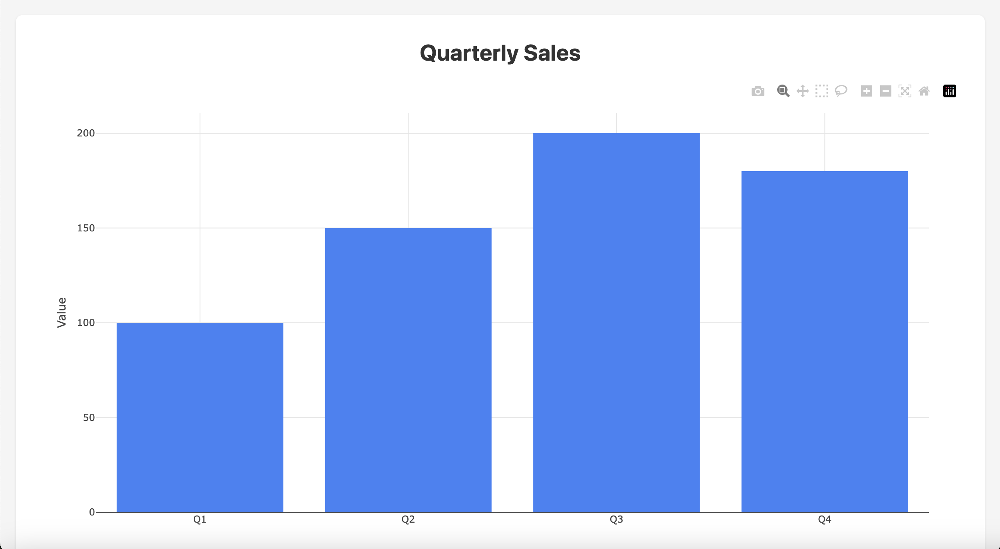
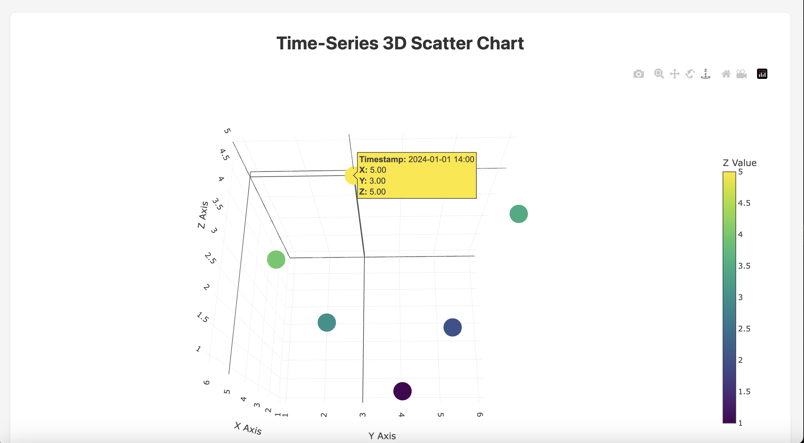

# Miniplot

Interactive chart visualization extension for DuckDB - faster than pandas with Plotly-like interactive charts, all from SQL.

## 🎯 Mission

**"One tool. One query. Instant visualization."**

Replace multiple libraries (pandas, matplotlib, seaborn, plotly) with a single tool. No more context switching, no more complex workflows.

- 📊 **Multiple chart types**: Bar, Line, Scatter, Area, and 3D Scatter charts
- 🌐 **Browser-based rendering**: Charts open in your default web browser
- 🔌 **Internet required**: Initial chart rendering requires connection (Plotly.js CDN)

## ✨ What's New in v0.0.3

- 3D Scatter Charts - Visualize three-dimensional data with interactive 3D scatter plots
- Timestamp Support - Add temporal dimension to 3D visualizations
- File Output Control - Save charts to custom paths or `/tmp/` directory
- Full Unicode Support - Complete support for Japanese and other non-ASCII characters
- Flexible Output Options - Browser (default), `/tmp/`, or custom path
- CSV Integration - Seamless data visualization from CSV files
- Batch Processing - Generate multiple charts and export paths with `COPY TO`

## Installation

```sql
INSTALL miniplot FROM community;
LOAD miniplot;
```

That's it! No additional setup required.

## 🚀 Easiest Example - 30 Seconds to Your First Chart

**Step 1: Create `test.csv` in your local directory**

```csv
product,revenue
iPhone,450
MacBook,380
iPad,290
AirPods,185
Watch,160
```

**Step 2: Open DuckDB CLI**

```bash
duckdb
```

**Step 3: Install and load miniplot**

```sql
INSTALL miniplot FROM community;
LOAD miniplot;
```

**Step 4: Visualize!**

```sql
SELECT bar_chart(
    list(product),
    list(revenue),
    'Product Revenue'
) FROM 'test.csv';
```

**Result:** Interactive chart opens in your browser instantly! 🎉

---

## Examples

### Bar Chart



### 3D Scatter Chart



## Usage Examples

### Basic Charts

#### Bar Chart

```sql
SELECT bar_chart(
    ['Q1', 'Q2', 'Q3', 'Q4'],
    [100.0, 150.0, 200.0, 180.0],
    'Quarterly Sales'
);
```

#### Line Chart

```sql
SELECT line_chart(
    ['Jan', 'Feb', 'Mar', 'Apr', 'May'],
    [5.2, 7.1, 12.5, 15.8, 20.3],
    'Monthly Temperature'
);
```

#### Scatter Chart

```sql
SELECT scatter_chart(
    [1.0, 2.0, 3.0, 4.0, 5.0],
    [2.5, 5.0, 7.5, 10.0, 12.5],
    'Correlation Analysis'
);
```

#### Area Chart

```sql
SELECT area_chart(
    ['Week1', 'Week2', 'Week3', 'Week4'],
    [1000.0, 1500.0, 1300.0, 1800.0],
    'Weekly Revenue'
);
```

### 3D Scatter Charts (New in v0.0.3)

#### Basic 3D Scatter

```sql
-- Opens in browser
SELECT scatter_3d_chart(
    [1.0, 2.0, 3.0, 4.0, 5.0, 6.0],
    [2.0, 4.0, 1.0, 5.0, 3.0, 6.0],
    [3.0, 1.0, 4.0, 2.0, 5.0, 3.5],
    '3D Data Visualization'
);
```

#### 3D Scatter with Timestamps

```sql
-- Add temporal dimension
SELECT scatter_3d_chart(
    [1.0, 2.0, 3.0, 4.0, 5.0, 6.0],
    [2.0, 4.0, 1.0, 5.0, 3.0, 6.0],
    [3.0, 1.0, 4.0, 2.0, 5.0, 3.5],
    ['2024-01-01 10:00', '2024-01-01 11:00', '2024-01-01 12:00',
     '2024-01-01 13:00', '2024-01-01 14:00', '2024-01-01 15:00'],
    'Time-Series 3D Scatter'
);
```

### Output Control (New in v0.0.3)

```sql
-- Save to /tmp/ without opening browser
SELECT bar_chart(
    ['A', 'B', 'C'],
    [10.0, 20.0, 15.0],
    'Sample Chart',
    'tmp'
);

-- Save to custom path
SELECT line_chart(
    ['Q1', 'Q2', 'Q3', 'Q4'],
    [250.0, 320.0, 410.0, 380.0],
    'Quarterly Report',
    'reports/q4_sales.html'
);

-- Save 3D chart to specific location
SELECT scatter_3d_chart(
    [10.0, 20.0, 30.0, 40.0],
    [15.0, 25.0, 20.0, 35.0],
    [5.0, 10.0, 8.0, 12.0],
    ['09:00', '12:00', '15:00', '18:00'],
    'Sensor Data',
    'data/sensor_3d.html'
);
```

### Unicode Support (New in v0.0.3)

```sql
-- Japanese titles and labels
SELECT bar_chart(
    ['春', '夏', '秋', '冬'],
    [15.0, 28.0, 18.0, 5.0],
    '季節別平均気温（℃）'
);

-- Japanese data with timestamps
SELECT scatter_3d_chart(
    [10.0, 20.0, 30.0],
    [15.0, 25.0, 20.0],
    [5.0, 10.0, 8.0],
    ['午前', '正午', '午後'],
    '温度センサー',
    'temp_sensor.html'
);
```

### Working with Tables

```sql
-- Create sample data
CREATE TABLE sales AS
SELECT 'Mon' as day, 100.0 as amount UNION ALL
SELECT 'Tue', 150.0 UNION ALL
SELECT 'Wed', 120.0 UNION ALL
SELECT 'Thu', 180.0 UNION ALL
SELECT 'Fri', 140.0;

-- Visualize directly from table
SELECT bar_chart(
    list(day ORDER BY day),
    list(amount ORDER BY day),
    'Weekly Sales Report'
) FROM sales;
```

### Working with CSV Files

```sql
-- Load CSV data
CREATE TABLE stocks AS
SELECT * FROM read_csv_auto('stocks.csv');

-- Visualize stock prices
SELECT line_chart(
    list(CAST(date AS VARCHAR) ORDER BY date),
    list(price ORDER BY date),
    'Stock Price Trend'
)
FROM stocks;

-- Direct CSV visualization
SELECT bar_chart(
    list(month),
    list(sales),
    'Monthly Sales from CSV',
    'output.html'
) FROM read_csv('sales.csv');
```

### Advanced CSV Processing

```sql
-- Filter and visualize
SELECT line_chart(
    list(date ORDER BY date),
    list(temperature ORDER BY date),
    '2024 Temperature Trend',
    'temp_2024.html'
) FROM read_csv('weather.csv')
WHERE date >= '2024-01-01' AND date < '2025-01-01';

-- Aggregate and visualize top 10
SELECT bar_chart(
    list(customer_name ORDER BY total_sales DESC),
    list(total_sales ORDER BY total_sales DESC),
    'Top 10 Customers',
    'top_customers.html'
) FROM (
    SELECT customer_name, sum(sales) AS total_sales
    FROM read_csv('customer_sales.csv')
    GROUP BY customer_name
    ORDER BY total_sales DESC
    LIMIT 10
);
```

### Batch Chart Generation with COPY TO

```sql
-- Generate single chart and save path
COPY (
    SELECT
        'bar_chart' AS chart_type,
        bar_chart(
            ['A', 'B', 'C'],
            [10.0, 20.0, 15.0],
            'Sample Chart',
            'output_bar.html'
        ) AS file_path
) TO 'chart_paths.csv' (HEADER, DELIMITER ',');

-- Generate multiple charts and export paths
COPY (
    SELECT 'bar_chart' AS type,
           bar_chart(['A','B','C'], [10,20,15], 'Bar', 'bar.html') AS path
    UNION ALL
    SELECT 'line_chart' AS type,
           line_chart(['X','Y','Z'], [5,10,8], 'Line', 'line.html') AS path
    UNION ALL
    SELECT 'scatter_chart' AS type,
           scatter_chart([1,2,3], [2,4,3], 'Scatter', 'scatter.html') AS path
) TO 'all_charts.csv' (HEADER);
```

## Requirements

- **Internet connection**: Required for first-time chart rendering (Plotly.js loads from CDN)
- **Browser**: Any modern web browser (Chrome, Firefox, Safari, Edge)
- After initial use, charts work offline (browser caches Plotly.js)

## License

MIT License - see [LICENSE](LICENSE) file

## Acknowledgments

- Built with [DuckDB](https://duckdb.org/)
- Powered by [Plotly.js](https://plotly.com/javascript/)
- Written in C++

## Links

- [Community Extensions](https://github.com/duckdb/community-extensions)
- [Issue Tracker](https://github.com/nkwork9999/miniplot/issues)
- [DuckDB Documentation](https://duckdb.org/docs/)
